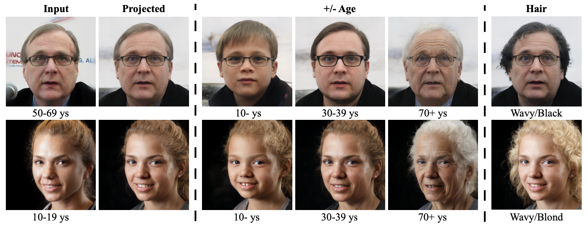
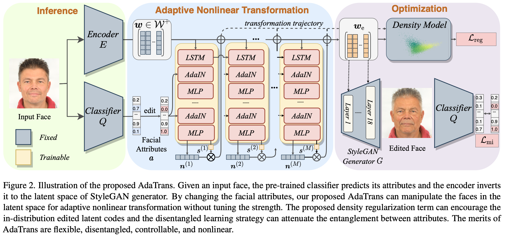
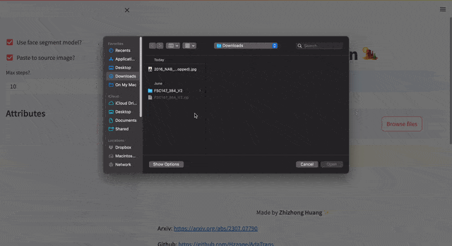

# AdaTrans

Official code for `Adaptive Nonlinear Latent Transformation for Conditional Face Editing, ICCV 2023`, https://arxiv.org/abs/2307.07790

> Adaptive Nonlinear Latent Transformation for Conditional Face Editing
> https://arxiv.org/abs/2307.07790
> Recent works for face editing usually manipulate the latent space of StyleGAN via the linear semantic directions. However, they usually suffer from the entanglement of facial attributes, need to tune the optimal editing strength, and are limited to binary attributes with strong supervision signals. This paper proposes a novel adaptive nonlinear latent transformation for disentangled and conditional face editing, termed AdaTrans. Specifically, our AdaTrans divides the manipulation process into several finer steps; i.e., the direction and size at each step are conditioned on both the facial attributes and the latent codes. In this way, AdaTrans describes an adaptive nonlinear transformation trajectory to manipulate the faces into target attributes while keeping other attributes unchanged. Then, AdaTrans leverages a predefined density model to constrain the learned trajectory in the distribution of latent codes by maximizing the likelihood of transformed latent code. Moreover, we also propose a disentangled learning strategy under a mutual information framework to eliminate the entanglement among attributes, which can further relax the need for labeled data. Consequently, AdaTrans enables a controllable face editing with the advantages of disentanglement, flexibility with non-binary attributes, and high fidelity. Extensive experimental results on various facial attributes demonstrate the qualitative and quantitative effectiveness of the proposed AdaTrans over existing state-of-the-art methods, especially in the most challenging scenarios with a large age gap and few labeled examples.

**If you found this code helps your work, do not hesitate to cite my paper or star this repo!**

*example results*



*Framework*


# Training and Evaluation

**Requirements**: PyTorch, `pip install streamlit pillow opencv-python tqdm`
**Training data**: Download the datasets [FFHQ](https://github.com/NVlabs/ffhq-dataset) and [CelebA](https://mmlab.ie.cuhk.edu.hk/projects/CelebA.html). The age labels of FFHQ come from [here](https://github.com/royorel/Lifespan_Age_Transformation_Synthesis/tree/master), and can be downloaded from our links below. CelebA should be aligned like FFHQ, see https://github.com/NVlabs/ffhq-dataset/blob/master/download_ffhq.py

**Training**: We provide the training code in `training`.

1. `training/train_realnvp_and_classifier.ipynb` trains the attribute classifier, the realnvp model, and extracts the latent codes.
2. `training/train_onehot.py` trains onehot conditions like hair color or style.
3. `training/train.py` trains binary attributes such as gender, and eyeglass.

`training/train.sh` provides some example scripts:
```sh
#eyeglass
python train.py --max_steps 10 --changes 15 --keeps 20 -1 --run_name 15
#gender
python train.py --max_steps 10 --changes 20 --keeps 15 -1 --run_name 20
#age
python train.py --max_steps 10 --changes -1 --keeps 15 20 --run_name Age
#smile
python train.py --max_steps 10 --changes 31 --keeps 15 20 -1 --run_name 31
#young
python train.py --max_steps 10 --changes 39 --keeps 15 20 --run_name 39

#hair color
python train_onehot.py --max_steps 10 --changes 8 9 11 --keeps 15 20 31 -1 --run_name 8_9_11
#hair type
python train_onehot.py --max_steps 10 --changes 32 33 --keeps 15 20 31 -1 --run_name 32_33
```

**Evaluation**: `evaluation.ipynb` evaluates the performance on single attributes.

# Pre-trained models

The pre-trained models can be downloaded at:
* Google Drive: https://drive.google.com/drive/folders/1T5y6l5Byl4pDzFCcDRXDOmmXde2HGg5U?usp=sharing
* Baidu Disk: https://pan.baidu.com/s/1msVQw5M7KK2MT7jnC26Fhw  1y2x

Download all needed models, and put them into `data/`.

The models include (1) attribute classifier (Resnet34 and Resnet50); (2) realnvp density model; (3) Face segmentation, E4E encoder, and official StyleGAN2 model; and (4) all train latent codes and predictions of FFHQ datasets (Do not download if you do not train your own model).

# Demo

The web ui demo looks like this:


If all models are downloaded, just run:
```sh
streamlit run webui/app.py
```

We additionally support (1) Segmenting the faces to preserve the background (2) Paste to input images for in-the-wild editing (3) Showing the facial attributes. The first result is the reconstructed face by E4E encoder.

Note that face align consumes the most costs in the current version~(dlib like FFHQ dataset). One may opt to MTCNN and so on for faster speed.

**We appreciate for any citations or stars if you found this work is helpful**

# Citation
If you found this code or our work useful please cite us:

```bibtex
@inproceedings{huang2023adaptive,
  title={Adaptive Nonlinear Latent Transformation for Conditional Face Editing
},
  author={Huang, Zhizhong and Ma, Siteng and Zhang, Junping and Shan, Hongming},
  booktitle={ICCV},
  year={2023}
}
```